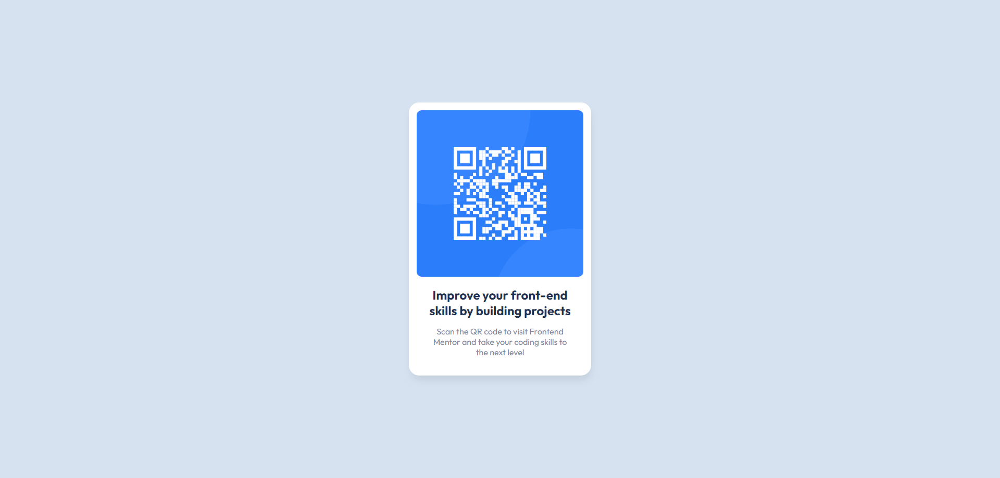

# Frontend Mentor - QR code component solution

This is a solution to the [QR code component challenge on Frontend Mentor](https://www.frontendmentor.io/challenges/qr-code-component-iux_sIO_H)

## Table of contents

- [Overview](#overview)
  - [Screenshot](#screenshot)
  - [Links](#links)
- [My process](#my-process)
  - [Built with](#built-with)
  - [Continued development](#continued-development)
  - [Useful resources](#useful-resources)
- [Author](#author)

## Overview

### Screenshot

### Links

- Solution URL: [GitHub](https://github.com/KTDKasp/fmio-qr-code-layout)

## My process

### Built with

- Semantic HTML5 markup
- CSS custom properties
- Flexbox

### Continued development

I want to continue focusing on adaptive layouts.

### Useful resources

- [MDN Box Shadow](https://developer.mozilla.org/ru/docs/Web/CSS/box-shadow) - This helped me for making box-shadow.

## Author

- Frontend Mentor - [@KTDKasp](https://www.frontendmentor.io/profile/KTDKasp)
